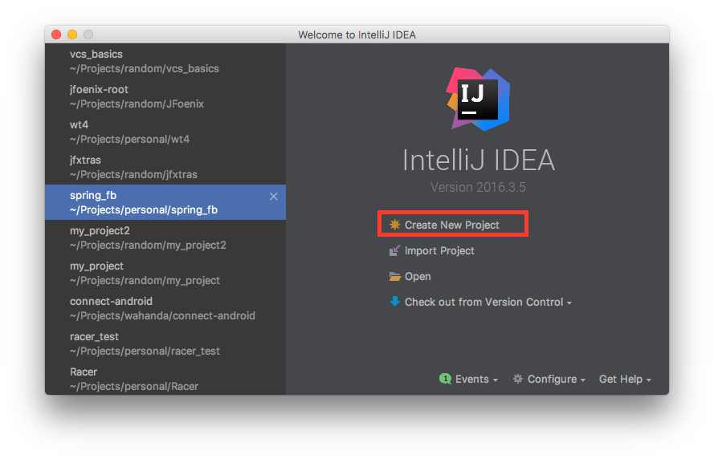
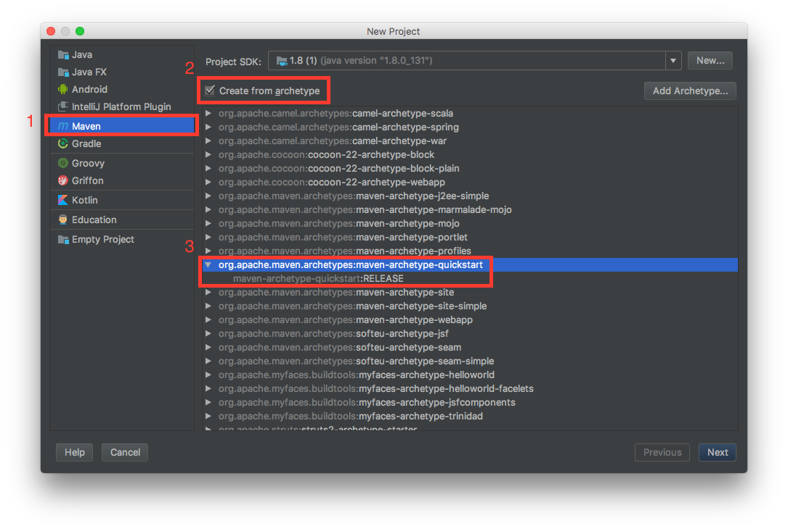
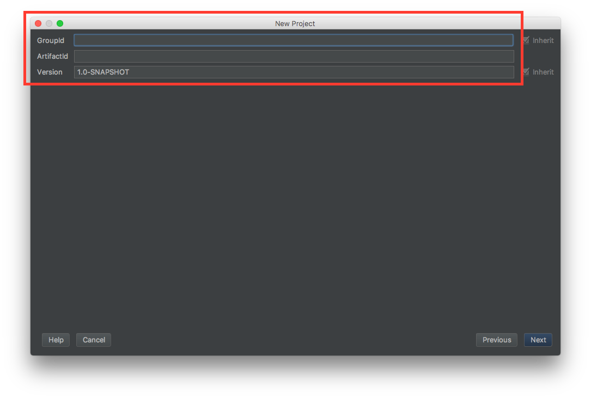
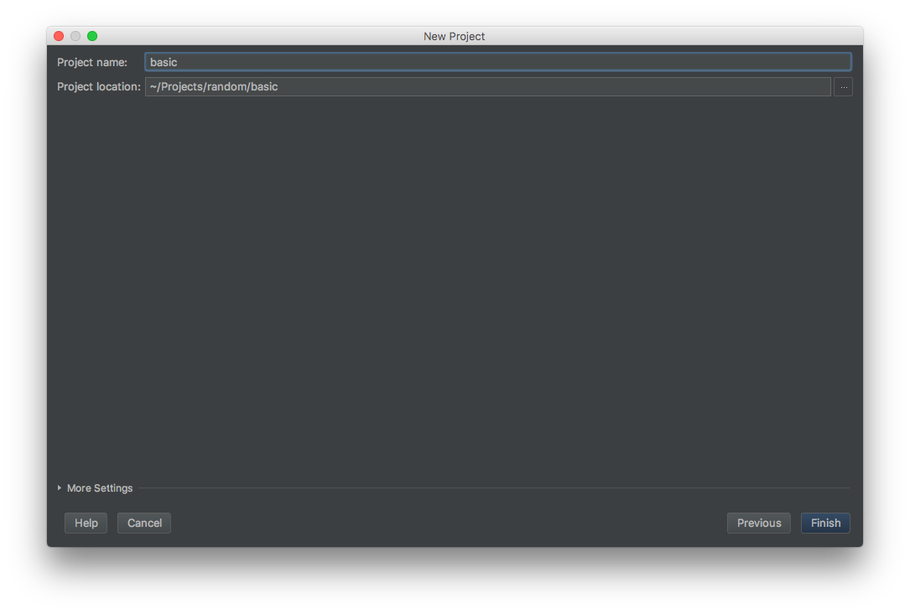
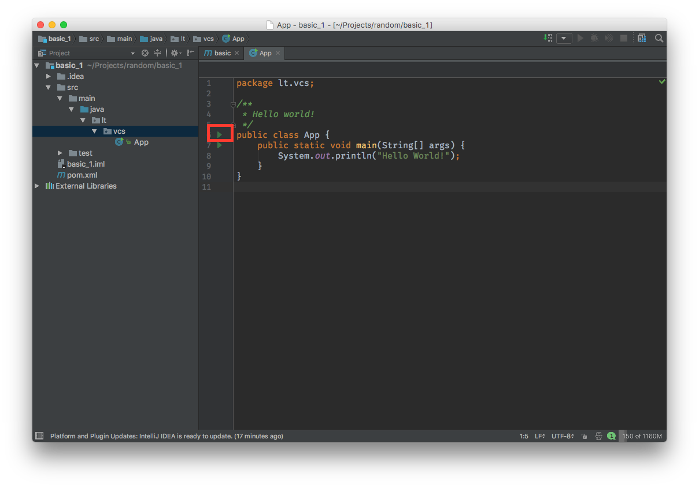
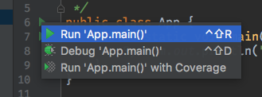
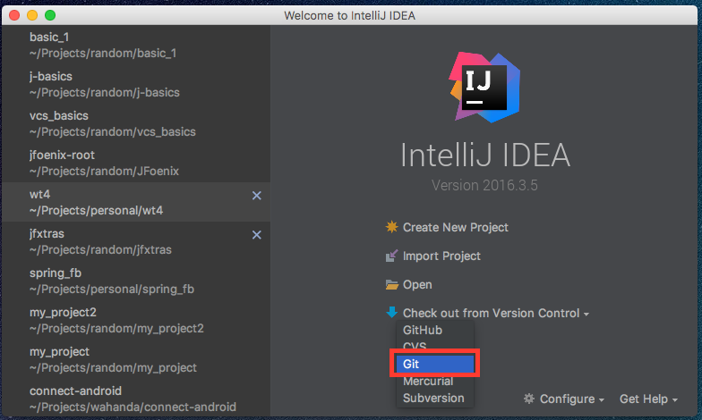
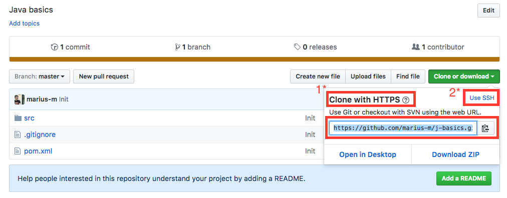
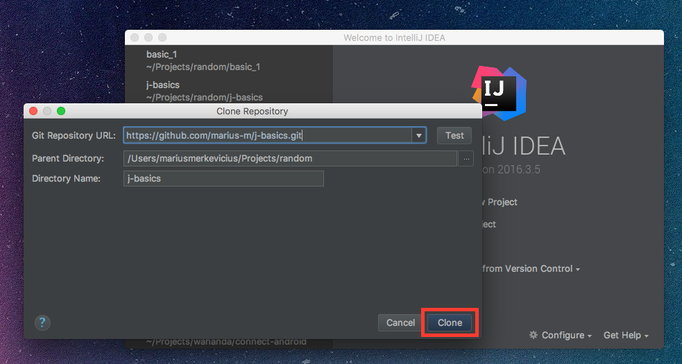

# Help running things

## Set up new project

- Open IntelliJ
- "Create new Project"

1. In left side press "Maven"
2. Press checkbox "Create from archetype"
3. Select "...maven-archetype-quickstart"

- Enter group name (eg.: lt.vcs)
- Enter artefact id (eg.: basic)

- Just "Next"

- Just "Finish" (or edit where your would like to keep your projects)

## Running project

- Open project
- Press tiny green arrow beside main class

- Press run "App.main()"

## Open example project from Git

- Close any open project
- Press "Check out from Version Control" 

- Go to https://github.com/marius-m/j-basics
- Click on "Clone or download"

 - 1 Make sure "Clone with https is selected"
 - 2 ...if its not, press "Use HTTPS" in the right corner

- Paste link inside

- Paste link into the "Git repository URL"

- Just "Clone"

## Import local project

- Press "Import Project"

- Navigate to the project directory 
 - If you have a zip, unarchive it and navigate to it

- *Important!* Press "Import project from external model"
- *Important!* Press "Maven" from the bottom list

- "Next"

- "Next" 

- "Next" 

- "Finish"

